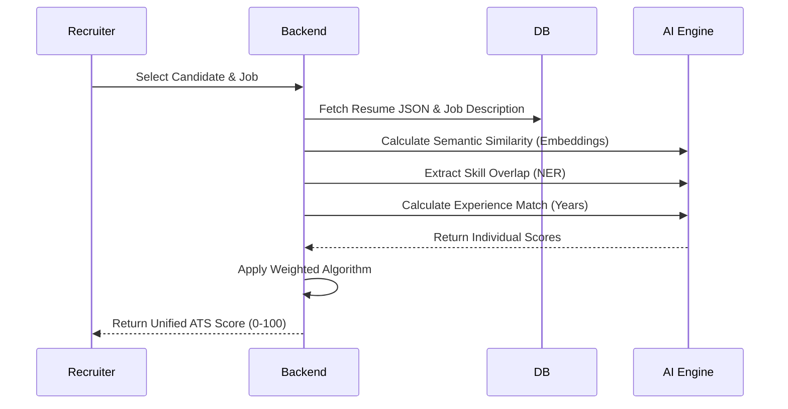
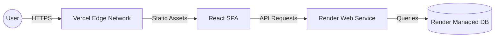

# Architecture & System Design

HireSense AI is built on a modern, decoupled architecture designed for scale, performance, and seamless AI integration.

## High-Level Architecture

The system consists of three primary layers:
1. **Frontend (Client Layer)**: React 19 SPA built with Vite, styled with TailwindCSS, and state managed by Zustand/React Query.
2. **Backend (API Layer)**: FastAPI (Python 3.11) handling business logic, authentication, and communication with the database.
3. **Intelligence Layer**: Specialized micro-services within the backend handling Resume Parsing (PyMuPDF, spaCy), Semantic Matching (Sentence-Transformers), and generative logic (Gemini API).

```mermaid
graph TD
    Client[Client (React/Vite)] -->|REST API| API[FastAPI Backend]
    API -->|Read/Write| DB[(PostgreSQL)]
    API -->|Auth| JWT[JWT Authentication]
    API -->|Parse| ResumeEngine[Resume Intelligence Engine]
    ResumeEngine -->|NLP| spaCy[spaCy NER]
    ResumeEngine -->|Embeddings| SentenceTransformers[Sentence-Transformers]
    ResumeEngine -->|Generative AI| Gemini[Gemini Pro]
```

## ATS Scoring Workflow

The ATS calculation involves multiple weighted dimensions to generate a unified match score.



## Deployment Architecture

The application is deployed across managed serverless platforms.


