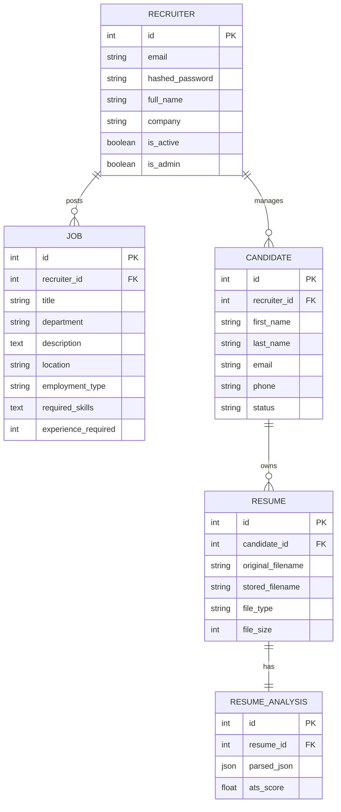

# Database Architecture

HireSense AI utilizes a relational database (PostgreSQL in production, SQLite in development) managed via SQLAlchemy ORM.

## Entity-Relationship (ER) Diagram

The core schema revolves around the `Recruiter`, their `Jobs`, and the `Candidates` applying with their `Resumes`.

